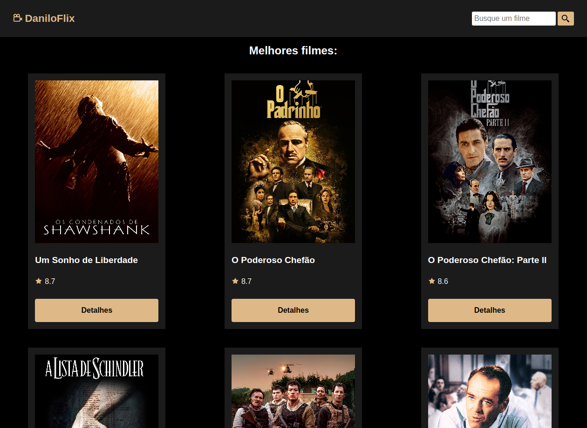
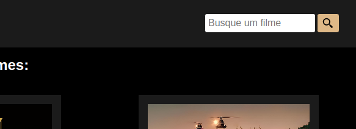
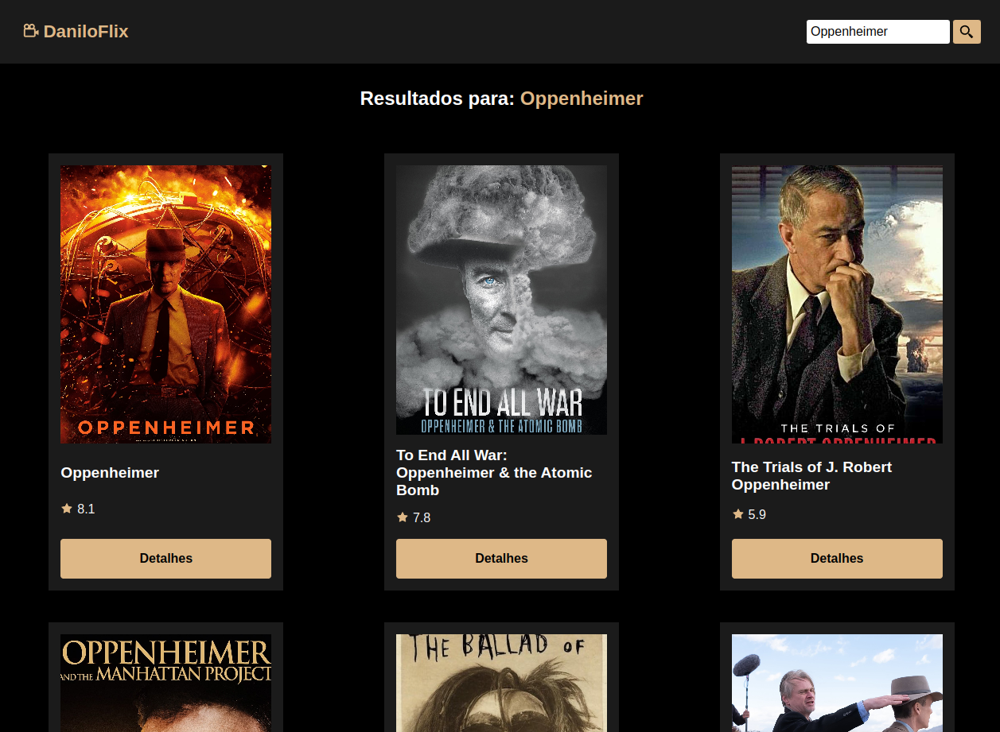
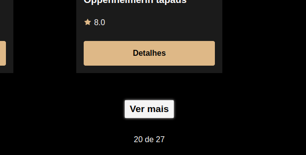

[PROJECT__BADGE]: https://img.shields.io/badge/📱Visit_this_project-000?style=for-the-badge&logo=project
[PROJECT__URL]: https://danwiilocarvalho.github.io/daniloflix
# DaniloFlix 🎥



## Tabela de conteúdos
* [Sobre](#-sobre)
* [Tecnologias utilizadas](#-tecnologias-utilizadas)
* [Requisitos](#requisitos)
* [Instalação](#-instalação)
* [Como usar o Daniloflix](#como-usar-o-daniloflix)
* [Licença](#licença)

## 📌 Sobre

`DaniloFlix` é um catálogo de filmes desenvolvido como uma aplicação web de página única (SPA) utilizando a biblioteca React. Ele consome a API do [TMDB](https://developer.themoviedb.org/docs/getting-started) (The Movie Database) para buscar e exibir informações sobre filmes.

Daniloflix foi desenvolvido com o intuito de pôr em prática os conhecimentos em desenvolvimento web e suas tecnologias, como a criação de componentes com biblioteca React, web design responsivo e roteamento através do React Router DOM.

Visite o projeto: https://danwiilocarvalho.github.io/daniloflix

## 💻 Tecnologias utilizadas

<div style="display: flex; flex-wrap: wrap; gap: 1rem">


</div>

## ⚙️ Instalação

### Requisitos

Antes de iniciar, você deve ter o Node.js, NPM e o Git instalados em sua máquina. O Vite 4.3.2, versão utilizada neste projeto, requer as versões 14.18+ ou 16+ do Node.js.

### Clonando o projeto

Para executar o projeto localmente, você deve primeiramente cloná-lo em sua máquina. Para isso, você pode executar o seguinte comando em seu terminal:

```bash
git clone https://github.com/DanwiiloCarvalho/daniloflix.git
```
Logo em seguida, você deve instalar todas as dependências do projeto com o seguinte comando:

```bash
cd daniloflix
npm install
```
Por último, para executar o projeto basta executar o comando:
```bash
npm run dev
```

## Como usar o Daniloflix

Ao abrir o `Daniloflix` em sua paǵina inicial, os 20 melhores filmes no ranking do TMDB serão exibidos, todos em formato de cards. Cada card exibe o pôster do filme, o título, a sua nota no TMDB e um botão que redireciona para a página de detalhes do filme:

<br>

Também é possível realizar a busca por um filme através da caixa de pesquisa, basta escrever o termo a ser pesquisado e clicar no botão "lupa" ou teclar "Enter":

<br>

Ao pesquisar pelo termo, uma lista de no máximo 20 filmes será exibida:

<br>

Caso o resultado da busca ultrapasse 20 registros, um botão `Ver mais` aparecerá abaixo dos últimos resultados, permitindo assim a exibição dos filmes restantes:

<br>

Após clicar no botão `Detalhes`em um card de um filme, você será redirecionado para a página de detalhes do filme em questão. A página contém:

* Pôster
* Título
* Nota
* Subtítulo
* Orçamento
* Receita
* Duração
* Descrição
* Trailers (caso possua trailers disponíveis no YouTube)

<br>

## Licença
Este projeto está sob a licença MIT. Consulte o arquivo `LICENSE` para mais informações.